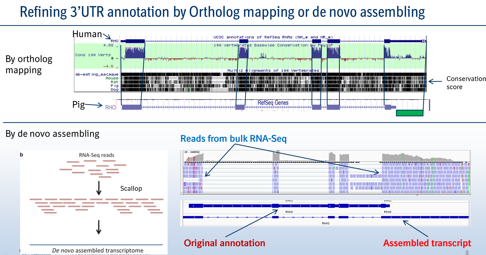
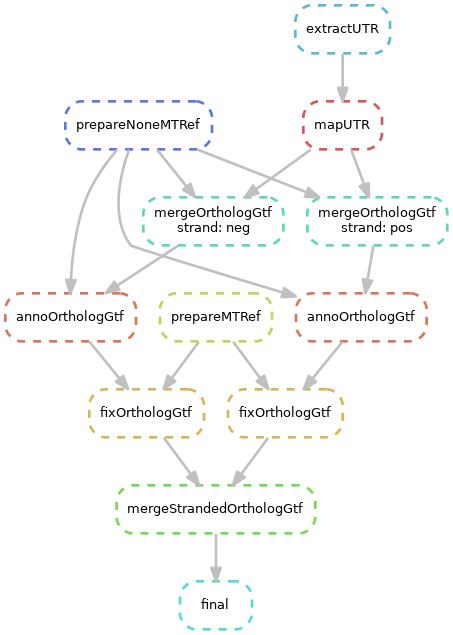
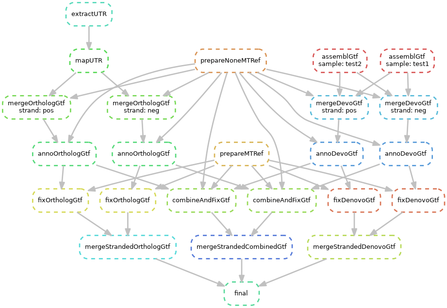
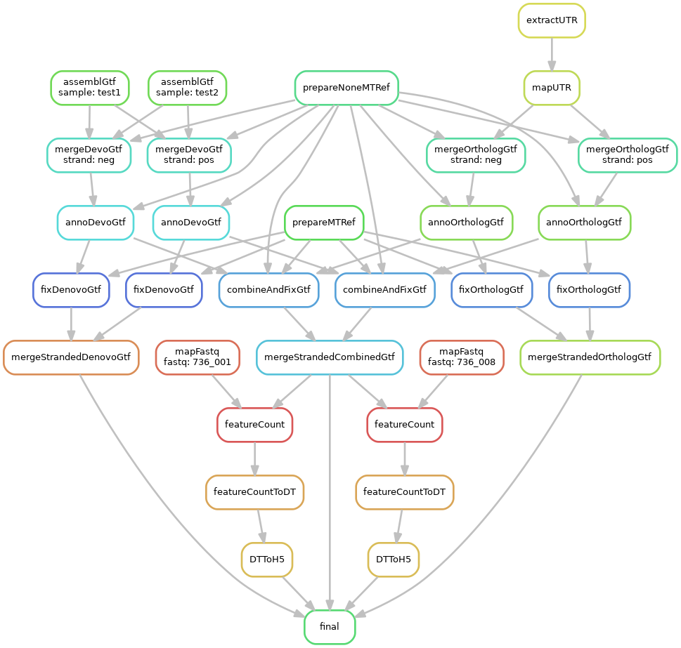
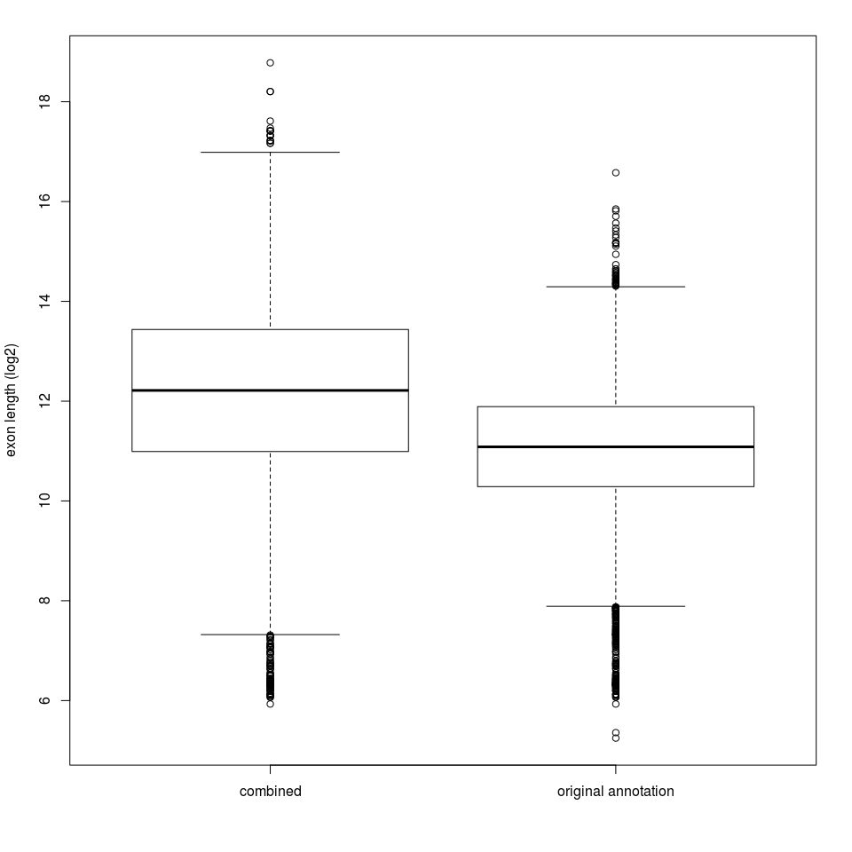
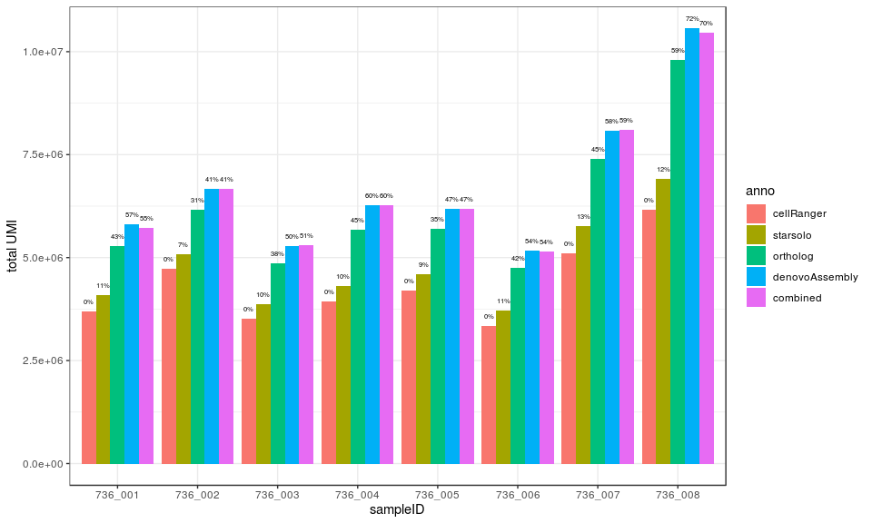
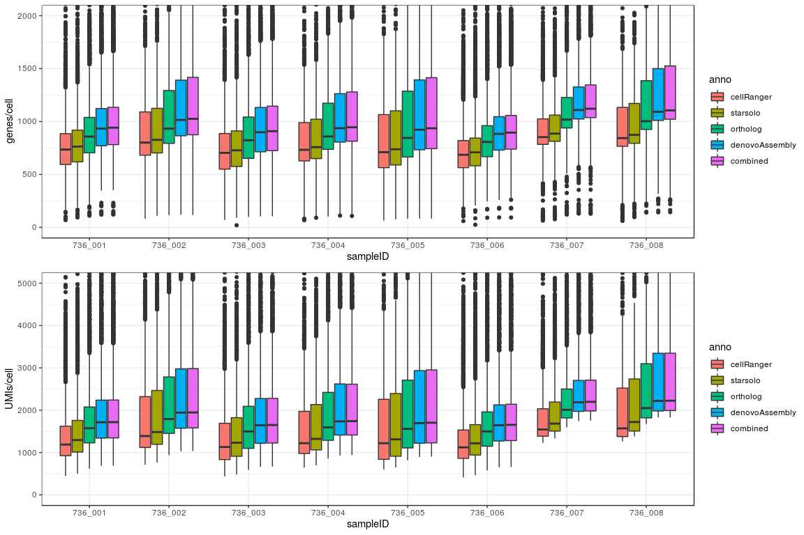

<!-- vim-markdown-toc GitLab -->

* [General](#general)
* [Authors](#authors)
* [Requirements](#requirements)
* [Introduction](#introduction)
	* [Two approaches for improving gene annotation](#two-approaches-for-improving-gene-annotation)
	* [DAG of workflow](#dag-of-workflow)
		* [Without bulk RNA-Seq data](#without-bulk-rna-seq-data)
		* [With bulk RNA-Seq data](#with-bulk-rna-seq-data)
		* [If the scRNA-Seq reads are provided](#if-the-scrna-seq-reads-are-provided)
	* [Performance](#performance)
* [Usage](#usage)
	* [Setup](#setup)
		* [With conda](#with-conda)
		* [With Singurlarity image](#with-singurlarity-image)
		* [Submit to HPC with Singurlarity image](#submit-to-hpc-with-singurlarity-image)
			* [Submit the master job to cluster, then the other sub jobs will be submitted by the master job](#submit-the-master-job-to-cluster-then-the-other-sub-jobs-will-be-submitted-by-the-master-job)
			* [Or you can use run the master snakemake job locally, the other sub jobs will be submitted by the master job.](#or-you-can-use-run-the-master-snakemake-job-locally-the-other-sub-jobs-will-be-submitted-by-the-master-job)
	* [Input](#input)
	* [Config file](#config-file)
		* [Parameters for GTF improvement](#parameters-for-gtf-improvement)
		* [Parameters for quantification using STARSolo with improved GTF](#parameters-for-quantification-using-starsolo-with-improved-gtf)
	* [Run pipeline](#run-pipeline)
		* [Conda](#conda)
		* [Singularity](#singularity)
	* [Output](#output)
	* [Example](#example)
		* [Quantification with combined GTF:](#quantification-with-combined-gtf)
		* [Quantification with ortholog GTF:](#quantification-with-ortholog-gtf)
		* [Quantification with denovo assembled GTF:](#quantification-with-denovo-assembled-gtf)
		* [Command for submitting the jobs to HPC cluster](#command-for-submitting-the-jobs-to-hpc-cluster)
	* [Troubleshoot](#troubleshoot)
* [Change log](#change-log)
	* [v1.0.0](#v100)
	* [v1.1.0](#v110)

<!-- vim-markdown-toc -->

# General

[](https://snakemake.bitbucket.io)

A snakemake pipeline improves the gene annotation for cross species analysis of single cell RNA-Seq.

Droplet-based single-cell RNA-Seq protocols such as 10X Genomics Chromium, cel-seq2 are widely used because of the dramatic increase of throughput for detecting cells. Since these methods only enrich cDNA fragments closed to polyadenylation (polyA) tails, data generated by these protocols is highly biased to the 3’ end of transcripts where the 3’UTR is normally located. The sensitivity and specificity of scRNA-Seq on detecting expressed gene therefore are confounded by the quality of 3’UTR annotation. 

Here, we implemented a computational pipeline can improve the tissue or species specific 3’UTR annotation by leveraging on 1) de novo assembly of transcriptome with bulk RNA-Seq data and 2) ortholog of  3’UTR from well-annotated species. We show that ~40%-70% more UMIs can be assigned back to genes after applying this approach to 10X scRNA-Seq data generated from Pig retina, of which the 3’UTRs are pooly annotated. 

For version history, see the [change log](#change-log). 

# Authors

* Yang Shen (yang_3.shen@boehringer-ingelheim.com)

# Requirements

* Miniconda

Miniconda can be installed with user's account:

```bash
  wget -c https://repo.anaconda.com/miniconda/Miniconda3-latest-Linux-x86_64.sh
  bash Miniconda3-latest-Linux-x86_64.sh
  conda config --add channels defaults
  conda config --add channels bioconda
  conda config --add channels conda-forge
```

* Git (>=2.22.0)

```bash
conda install -c conda-forge git
```

 * Snakemake (>=5.32.0)

Install Snakemake using [conda](https://conda.io/projects/conda/en/latest/user-guide/install/index.html):
For installation details, see the [instructions in the Snakemake documentation](https://snakemake.readthedocs.io/en/stable/getting_started/installation.html).

```bash
conda install snakemake
```
 
***Or the pipeline can be run via Singualrity.***

* Singualrity

Please check if Singualrity is available:

```bash
  singularity run docker://godlovedc/lolcow
 _________________________________________
/ Learn to pause -- or nothing worthwhile \
\ can catch up to you.                    /
 -----------------------------------------
        \   ^__^
         \  (oo)\_______
            (__)\       )\/\
                ||----w |
                ||     ||
```

You need root permission to install singularity, please follow the [instructions on Singularity website](https://sylabs.io/guides/3.0/user-guide/installation.html).

# Introduction

## Two approaches for improving gene annotation


## DAG of workflow

### Without bulk RNA-Seq data
The GTF file can be improved by ortholog mapping. 

### With bulk RNA-Seq data
The pipeline can take the mapped bam files as inputs, the GTF file then will be improved by denovo assembly.

### If the scRNA-Seq reads are provided
The pipeline then can quantify the provided reads by STARSolo with improved GTF file, the gene count matrix will be saved in 10X h5 format, which can be loaded via other scRNA-Seq analysis package (e.g. Seurat) .

## Performance
By applying the workflow to pig retina data, the overall exon length can be extended by two folder on average .
The improvements on either total UMIs detected per sample, or # of detect gene/cell or # of UMIs/cell  are also shown below. 

# Usage

## Setup

### Step 1: Obtain a copy of this workflow

1. Create a new github repository using this workflow [as a template](https://help.github.com/en/articles/creating-a-repository-from-a-template).
2. [Clone](https://help.github.com/en/articles/cloning-a-repository) the newly created repository to your local system, into the place where you want to perform the data analysis.

```bash
  mkdir ~/src/
  cd ~/src/
  git -c http.sslVerify="false" -c http.proxy=  clone https://github.com/bi-compbio/scrnax.git
  cd scrnax/resources/
  tar xvfz tests.tar.gz
```
### Step 2: Configure workflow

Configure the workflow according to your needs via editing the files in the `config/` folder. Adjust `config.selftest.json` to configure the workflow execution.

### Step 3: Check if Snakemake is available

```bash
  snakemake -v
```

### Step 4: Execute workflow with self-test data

Test your configuration by performing a dry-run via

```bash
  cd ~/src/scrnax/
  snakemake --profile config/selftest/ --use-conda -n 
```

Execute the workflow locally via

```bash
  snakemake --profile config/selftest/ --use-conda --cores $N
```

using `$N` cores or run it in a HPC environment (slurm) via

```bash
    snakemake --profile config/slurm_selftest/ --use-conda
```

If you not only want to fix the software stack but also the underlying OS, use

```bash
    snakemake --profile config/selftest/ --use-conda --use-singularity
```

in combination with any of the modes above.
See the [Snakemake documentation](https://snakemake.readthedocs.io/en/stable/executable.html) for further details.


**If the files defined in config file are located outside of current working directory, then the folder or parent folder has to be mounted when running singularity**
For example, in the conf.json shown below, the files are all located in subfolder of  **/data/**.

```
{
  "resultdir": "pigGTF/",
  "goodGTF": "/data/cbsync/referencedata/annotations/homo_sapiens/ensembl/95/Homo_sapiens.GRCh38.95.gtf",
  "refGTF": "/data/cbsync/referencedata/annotations/sus_scrofa/ensembl/86/Sus_scrofa.Sscrofa10.2.86.gtf",
  "liftChain": "/data/cbsync/referencedata/annotations/homo_sapiens/ucsc/liftOver/hg38ToSusScr3.over.chain",
  "liftMinMatch": 0.7
}
```

Therefore, the **/data/** should be mounted by adding **--singularity-args "-B /data"** at the end of command:

```bash
snakemake --profile config/selftest/ --use-conda --use-singularity --singularity-args "-B /data"
```


## Input

* GTF gene annotation file of poorly annotated species of which the samples are from. (e.g., [pig](http://ftp.ensembl.org/pub/release-97/gtf/sus_scrofa_usmarc/)) 
* GTF gene annotation file of well annotated species that are evolutionary closed to the species of interest. (e.g, human), which can be downloaded from Ensembl (e.g., [human](http://ftp.ensembl.org/pub/release-97/gtf/homo_sapiens/)).
* LiftOver Chain file defines the ortholog synteny blocks by whole alignment, which can be download from UCSC (e.g, [hg38](http://hgdownload.cse.ucsc.edu/goldenpath/hg38/liftOver/))
* Bam files of bulk RNA-Seq (optional). These files will be used for denovo assembly.

## Config file

After downloading the files aforementioned, put the paths of those files into **conf.json**.
The parameters defined in conf.json are:

### Parameters for GTF improvement
- `resultdir`: the root path of outputs
- `goodGTF`: the GTF file of well annotated species (e.g., human)
- `refGTF`: the GTF file of pooly annotated species, of which the samples are from (e.g., pig)
- `liftChain`: the chain file for liftOver
- `liftMinMatch`: liftOver specific parameter, defines the minimum ratio of bases that must remap, which is range from 0~1
- `bamDir`, optional parameters, if the bulk RNASeq data is available, the bamDir defines the path of folder of bam files

### Parameters for quantification using STARSolo with improved GTF
- `StarsoloGenome`: the path of geome index of STARSolo
- `whitelist`: the path of barcode whitelist for correcting cell barcode. For 10X data, the whitelist can be obtained from cellRanger package, [V2] (https://github.com/10XGenomics/supernova/raw/master/tenkit/lib/python/tenkit/barcodes/737K-august-2016.txt) and V3 (local path: cellranger-3.0.2/cellranger-cs/3.0.2/lib/python/cellranger/barcodes/3M-february-2018.txt.gz)

> The STARSolo can handle any data in which the cell barcode + UMI (read1 for 10X) and cDNA (read2 for 10X) are separated. User needs to define the actual cell barcode length and UMI start position and length when using STARSolo. Please refer to STARSolo manual for details

- `CBLen`: cell barcode length, which is 16 for 10X data
- `UMIStart`: start position of UMI
- `UMILen`: length of UMI

## Run pipeline

### Conda

```bash
snakemake --profile config/local/ --use-conda --cores 16 --configfile conf.json --config bamDir='bams/'
```

### Conda + Singularity 

```bash
snakemake --profile config/local/ --use-conda --use-singularity --cores 16 --configfile conf.json --config bamDir='bams/'
```

## Output

The refined GTFs are three/two GTF files:
1. `{resultdir}/ortholog/fixed.gtf`: GTF is refined by ortholog mapping
2. `{resultdir}/denovo/fixed.gtf`: GTF is refined by denovo assembly (will be generated only if the bulk RNA-Seq bam files are provided)
3. `{resultdir}/combined.fixed.gtf`: GTF is refined by combining ortholog mapping and denovo assembly.

For example:

```bash
pigGTF/
├── combined.fixed.gtf
├── denovo
│   └── fixed.gtf
└── ortholog
    └── fixed.gtf
```

## Example

In this example, the pig ensembl annotated can be refined by human annotation and scRNA-Seq matched bulk RNA-Seq. (assume the working directory is ~/src/scrnax). 

If both the bam files of bulk RNA-Seq and the fastq files of scRNA-Seq are available, you can **skip `step 4` and `step 5`**. All of analyses, including GTF improvement and gene quantification can be done in **`step 6`**.

* Step 1. Download the pipeline code of scrnax:

```bash
mkdir ~/src/
cd ~/src/
git -c http.sslVerify="false" -c http.proxy=  clone https://git.eu.boehringer.com/bibc_compbio/scrnax.git
cd scrnax/resources/
tar xvfz tests.tar.gz
```

* Step 2. Download the pig and human GTF from Ensembl, the chain file from UCSC:

```bash
cd ~/src/scrnax/
# tar xvfz test.tar.gz
mkdir gtfs
cd gtfs
wget -c http://ftp.ensembl.org/pub/release-97/gtf/homo_sapiens/Homo_sapiens.GRCh38.97.gtf.gz
wget -c http://ftp.ensembl.org/pub/release-97/gtf/sus_scrofa_usmarc/Sus_scrofa_usmarc.USMARCv1.0.97.gtf.gz
gzip -d *.gz

cd ../
mkdir liftchain
cd liftchain
wget -c http://hgdownload.cse.ucsc.edu/goldenpath/hg38/liftOver/hg38ToSusScr11.over.chain.gz
gzip -d *.gz

```

* Step 3. Prepare the conf.json by filling the path of GTFs and liftOver chain file.

```bash
cd ~/src/scrnax/
cat <<EOT >conf.json
{
  "resultdir": "pigGTF/",
  "goodGTF": "gtfs/Homo_sapiens.GRCh38.97.gtf",
  "refGTF": "gtfs/Sus_scrofa_usmarc.USMARCv1.0.97.gtf",
  "liftChain": "liftchain/hg38ToSusScr11.over.chain",
  "liftMinMatch": 0.7
}
EOT
```

* Step 4. Launch the pipeline for ortholog mapping only.

```bash
snakemake --use-singularity --use-conda --profile config/local/ --configfile conf.json
```

The final improved GTF files are:

```bash
pigGTF/
├── combined.fixed.gtf
└── ortholog
    └── fixed.gtf
```

* Step 5. If the bam files are available, they can be added by either 1) defining in the conf.json or 2) adding "bamDir" when running snakemake.
First, some small bam files are provided as an example.

```bash
cd ~/src/scrnax/
ls resources/tests/bams/
```

Define the bamDir in json file (**note, the bamDir should be ended with "/"**):

```bash
cd ~/src/scrnax/
cat <<EOT >conf.json
{
  "resultdir": "pigGTF/",
  "goodGTF": "gtfs/Homo_sapiens.GRCh38.97.gtf",
  "refGTF": "gtfs/Sus_scrofa_usmarc.USMARCv1.0.97.gtf",
  "liftChain": "liftchain/hg38ToSusScr11.over.chain",
  "liftMinMatch": 0.7,
  "bamDir": "resources/tests/bams/"
}
EOT
snakemake --use-singularity --use-conda --profile config/local/ --configfile conf.json
```
Or it can be provided as an additional parameter: bamDir

```bash
cd ~/src/scrnax/
snakemake --use-singularity --use-conda --profile config/local/ --configfile conf.json --config bamDir=resources/tests/bams/
```

Alternativly, the pipeline can be run on HPC cluster:

```bash
snakemake --use-singularity --use-conda --profile config/slurm/ --configfile conf.json --config bamDir=resources/tests/bams/
```

Now the `combined.fixed.gtf` and `denovo/fixed.gtf` should be updated/added in the result folder.

```bash
pigGTF/
├── combined.fixed.gtf
├── denovo
│   └── fixed.gtf
└── ortholog
    └── fixed.gtf
```

* Step 6. If the fastq files of scRNA-Seq are available, the pipeline can offer gene level quantification by using STARSolo with the improved GTF. To provide fastq files, the parameter fastqDir needs to be set in either conf.json file or provided as additional parameter when running the pipeline. By default, the "combined GTF" will be used for quantification. It is possible to quantify the gene expression according to other GTF file by setting `countBy`.The `countBy` can be set as: ortholog, devnovo and combined.

Generate new json config file

```bash
cd ~/src/scrnax/
cat <<EOT >conf.fastq.json
{
  "resultdir": "pigGTF/",
  "goodGTF": "gtfs/Homo_sapiens.GRCh38.97.gtf",
  "refGTF": "gtfs/Sus_scrofa_usmarc.USMARCv1.0.97.gtf",
  "liftChain": "liftchain/hg38ToSusScr11.over.chain",
  "liftMinMatch": 0.7,
  
  "_comment_": "starsolo",
  "StarsoloGenome": "resources/tests/Sscrofa10.2.chr12_star2.7.1a/",
  "whitelist": "resources/tests/737K-august-2016.txt",
  "CBLen": 16,
  "UMIStart": 17,
  "UMILen": 10
}
EOT
```

### Quantification with combined GTF:

```bash
snakemake --use-singularity --use-conda --profile config/local/ --configfile conf.fastq.json  --config bamDir=resources/tests/bams/ fastqDir=resources/tests/fastqs/ countBy=combined
```

### Quantification with ortholog GTF:

```bash
snakemake --use-singularity --use-conda --profile config/local/ --configfile conf.fastq.json  --config bamDir=resources/tests/bams/ fastqDir=resources/tests/fastqs/ countBy=ortholog
```

### Quantification with denovo assembled GTF:

```bash
snakemake --use-singularity --use-conda --profile config/local/ --configfile conf.fastq.json  --config bamDir=resources/tests/bams/ fastqDir=resources/tests/fastqs/ countBy=denovo
```

### Command for submitting the jobs to HPC cluster

```bash
snakemake --use-singularity --use-conda --profile config/slurm/ --configfile conf.json  --config bamDir=resources/tests/bams/ fastqDir=resources/tests/fastqs/ countBy=combined
```

The gene count matrix (h5 format) will be stored in subfolder of featureCount folder.

```bash
pigGTF/featureCount/
├── combined
│   ├── 736_001.Aligned.sortedByCoord.out.bam.featureCounts.bam
│   ├── 736_001.counts.txt
│   ├── 736_001.counts.txt.summary
│   ├── 736_001.h5
│   ├── 736_001.tsv.gz
│   ├── 736_008.Aligned.sortedByCoord.out.bam.featureCounts.bam
│   ├── 736_008.counts.txt
│   ├── 736_008.counts.txt.summary
│   ├── 736_008.h5
│   └── 736_008.tsv.gz
├── denovo
│   ├── 736_001.Aligned.sortedByCoord.out.bam.featureCounts.bam
│   ├── 736_001.counts.txt
│   ├── 736_001.counts.txt.summary
│   ├── 736_001.h5
│   ├── 736_001.tsv.gz
│   ├── 736_008.Aligned.sortedByCoord.out.bam.featureCounts.bam
│   ├── 736_008.counts.txt
│   ├── 736_008.counts.txt.summary
│   ├── 736_008.h5
│   └── 736_008.tsv.gz
└── ortholog
    ├── 736_001.Aligned.sortedByCoord.out.bam.featureCounts.bam
    ├── 736_001.counts.txt
    ├── 736_001.counts.txt.summary
    ├── 736_001.h5
    ├── 736_001.tsv.gz
    ├── 736_008.Aligned.sortedByCoord.out.bam.featureCounts.bam
    ├── 736_008.counts.txt
    ├── 736_008.counts.txt.summary
    ├── 736_008.h5
    └── 736_008.tsv.gz

```

## Troubleshoot

### Unlock directory

If you have error like:

```bash
Error: Directory cannot be locked. Please make sure that no other Snakemake process is trying to create the same files in the following directory:
```
Please rerun the snakemake command with `--unlock` option.

```bash
snakemake --use-singularity --singularity-args "-B /data" --profile config/local/ --configfile conf.json --config fastqDir=fastqsslim --unlock
```

### Running pipeline outside

You can execute the pipeline in any directory. But you have to specify the path of pipeline script with `-s`. For example:

```bash
snakemake --use-singularity --singularity-args "-B /data" --profile config/local/ -s ~/src/scrnax/workflow/Snakefile --configfile conf.json --config fastqDir=fastqsslim
```

# Change log

## v1.0.0

Initial release

## v1.1.0

Gene level quantification via STARSolo with improved GTF
